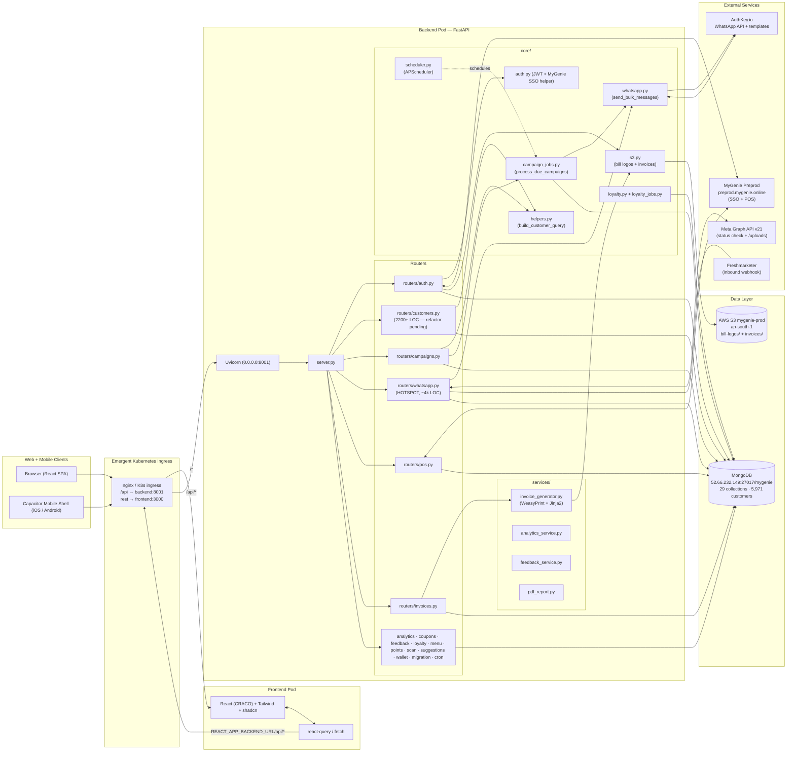
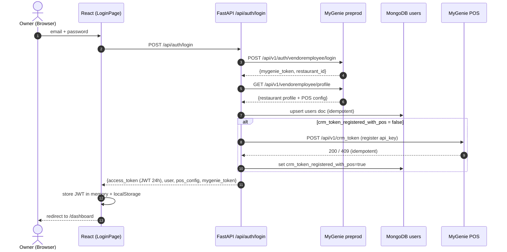
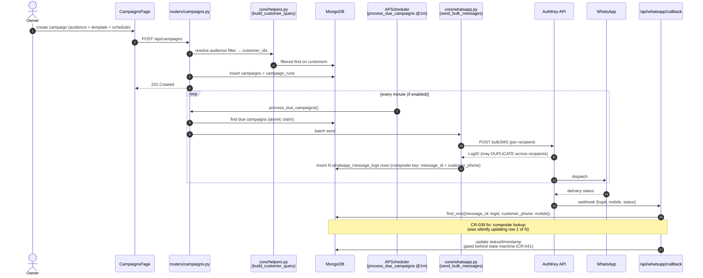
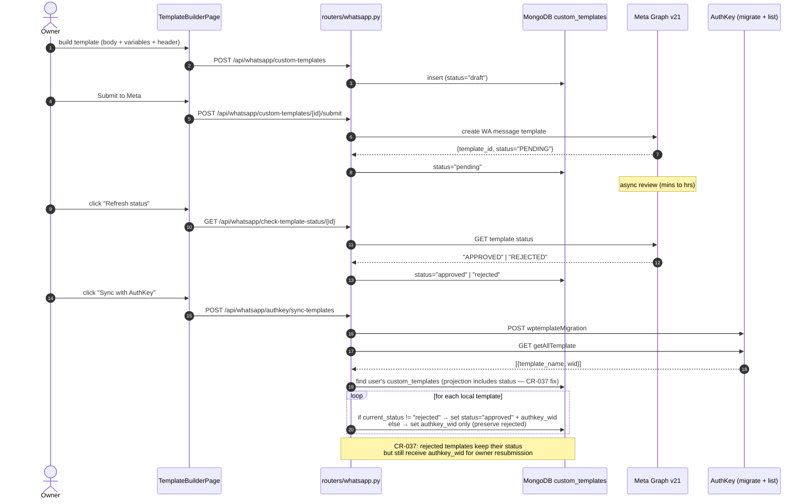
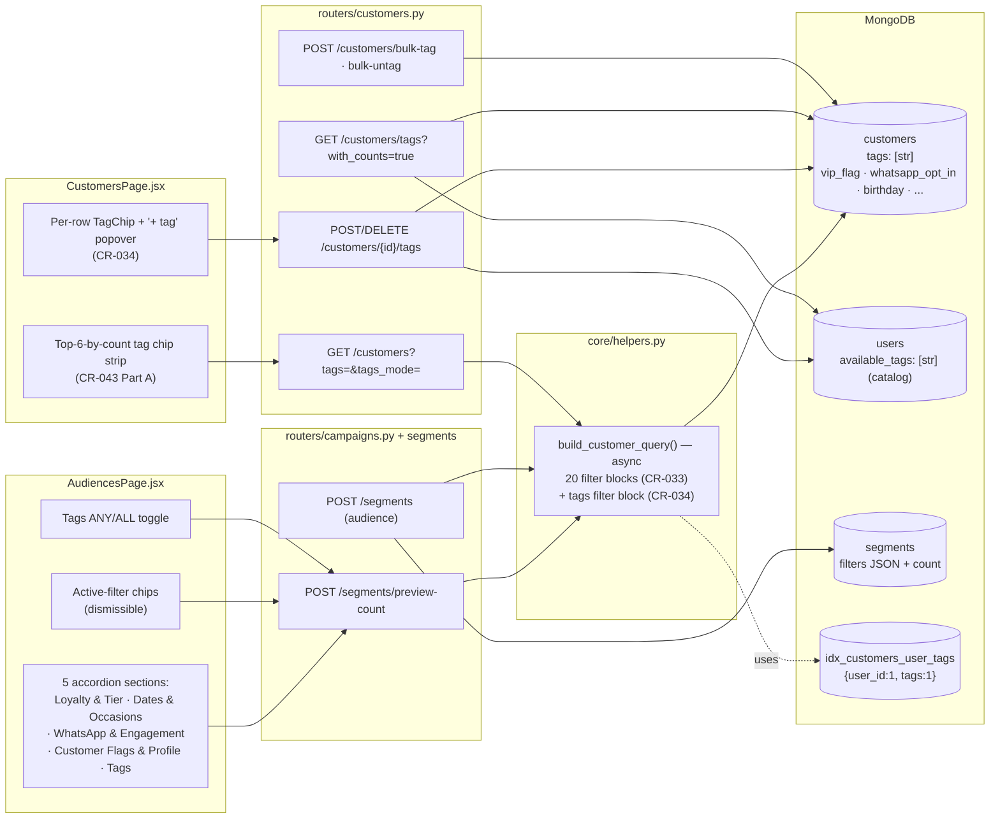
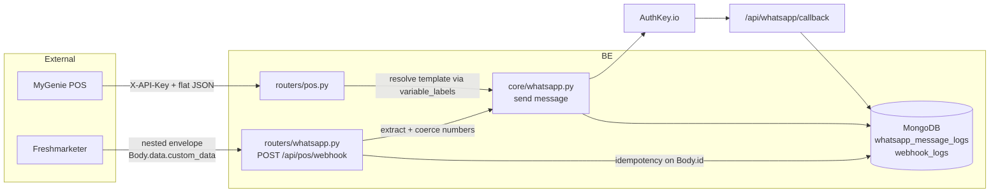
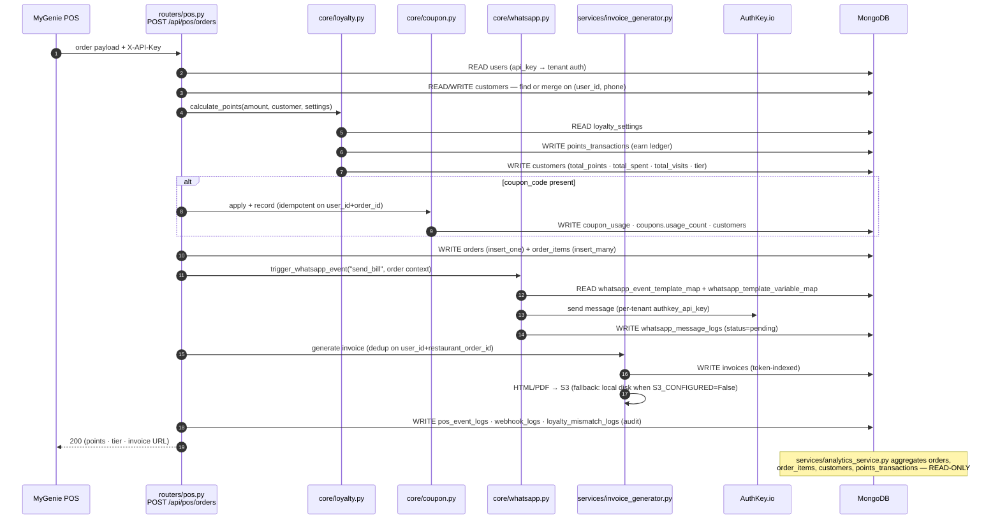
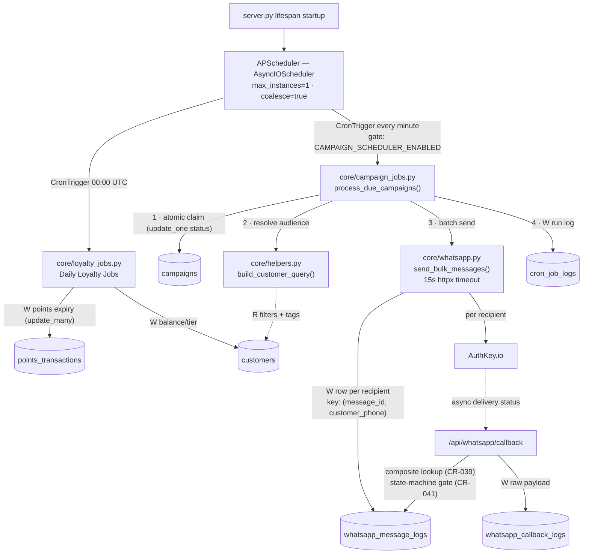

# MyGenie CRM — Architecture

> **Version**: 1.1 (2026-07-06 · Sprint 10 closure baseline + consolidated data-flow views)
> **Scope**: Full-stack architecture + primary data flows for the CRM Preprod deployment
> **Related docs**: `/app/memory/PRD.md`, `/app/memory/CR_STATUS_DASHBOARD.md`, `/app/memory/crm/crm_roi_sprint/handoff/SESSION_2026_07_06_SPRINT_CLOSURE.md`
> **Rendered visuals**: `<preview-url>/docs/architecture.html` (§1–6) · `<preview-url>/docs/dataflow.html` (§10–12)

---

## 1 · High-level system architecture

**Component notes**

- **Frontend (React SPA)** — CRACO build, Tailwind + shadcn UI, Capacitor mobile shell. All API calls go through `REACT_APP_BACKEND_URL` — never localhost.
- **Backend (FastAPI + Motor)** — single Uvicorn process on `:8001`. `server.py` mounts every router under `/api/*`. Motor is the async MongoDB driver. APScheduler runs two jobs: `Daily Loyalty Jobs` @ 00:00 UTC and `Process Due Campaigns` @ every minute (gated by `CAMPAIGN_SCHEDULER_ENABLED`).
- **MongoDB** — 29 preprod collections including `users` (tenants), `customers`, `campaigns`, `campaign_runs`, `whatsapp_message_logs`, `whatsapp_callback_logs`, `custom_templates`, `coupons`, `invoices`, `webhook_logs`.
- **AWS S3** — object storage for bill logos and rendered invoice HTML/PDF (CR-036 Batch A). Falls back to local disk if `S3_CONFIGURED=False`.
- **External integrations** — MyGenie POS/SSO, AuthKey (WhatsApp send + templates), Meta Graph API v21 (status + `/uploads` handle), Freshmarketer (webhook trigger).

---

## 2 · Authentication & session flow

**Notes** — `_register_crm_token_with_pos()` was fixed in CR-028+BUG-008 to skip on subsequent logins. JWT_SECRET is per-deployment; sessions are stateless.

---

## 3 · Campaign send data flow (CR-024 + CR-039)

**Key defensive properties**
- CR-039 composite `(message_id, customer_phone)` webhook lookup with `verdict="ambiguous_row"` skip on persistent mismatch.
- CR-041 timestamp block now AFTER state-machine gate (no overwrite on `transition_ignored`).
- `max_instances=1 + coalesce + 15 s httpx timeouts + atomic claim` — scheduler cannot hang the server.

---

## 4 · WhatsApp template lifecycle (CR-023 + CR-037)

---

## 5 · Audience segmentation + tagging (CR-033 + CR-034 + CR-043)

**BUG-A fix (CR-033)** — the six filters `vip_flag`, `whatsapp_opt_in`, `has_birthday_this_month`, `is_blocked`, `blacklist_flag`, `complaint_flag` are now gated by an explicit `!= 'all'` guard and proper truthy coercion. Previously the criteria were silently ignored (returned all 5,971 customers). Verified this session on preprod DB.

---

## 6 · POS + external send pipeline (CR-DIRECT-SEND + CR-030)

---

## 7 · Environment + configuration

| Variable | Purpose | Owner-supplied? |
|---|---|---|
| `MONGO_URL` / `DB_NAME` | MongoDB Atlas / self-hosted preprod | ✅ real value in `.env` |
| `JWT_SECRET` | JWT signing | ⚠ rotate for prod |
| `MYGENIE_API_URL` + endpoints | SSO + POS | ✅ preprod URLs |
| `AUTHKEY_*` | WhatsApp send + templates | ✅ preprod URLs (per-tenant key in DB) |
| `META_GRAPH_API_URL` | Template status + `/uploads` | ✅ v18 fixed |
| `PUBLIC_BACKEND_URL` | WeasyPrint absolute URLs for legacy logos | ✅ (CR-036 Batch A.1) |
| `AWS_S3_*` | Bill logos + invoice storage | ✅ real creds in `.env` |
| `CAMPAIGN_SCHEDULER_ENABLED` | Flip to `true` to auto-fire | ⚠ currently `false` |
| `CAMPAIGN_TIMEZONE` | APScheduler timezone | ✅ `Asia/Kolkata` |
| `POS_REQUEST_LOGGING_*` | Optional POS request audit trail | Optional |

`.env` files: `/app/backend/.env` and `/app/frontend/.env`. Ports (8001 backend, 3000 frontend) and Kubernetes ingress rules are locked; the Emergent platform routes `/api/*` → 8001 and everything else → 3000.

---

## 8 · Deployment & operational contract

- **Supervisor**: `sudo supervisorctl {status|restart <service>}` — backend restart is only needed for `.env` or dependency changes; hot-reload handles code.
- **Health check**: `GET /api/health` → `{"status":"healthy","timestamp":"…"}`.
- **Cron**: two APScheduler jobs — Daily Loyalty (00:00 UTC) and Process Due Campaigns (every minute, gated).
- **Data safety**: all destructive customer queries in tests use `AND` of prefix + name-prefix + `user_id` (RCA lock from iteration_4 QA incident).
- **Object storage fallback**: `S3_CONFIGURED=False` → all upload/download paths dual-mode to local disk (Batch A design property — no-op PR without AWS creds).

---

## 9 · Known hotspots & tech debt (open backlog)

- `routers/customers.py` > 2,200 LOC — refactor into `customer_tags.py`, `customer_segments.py`, `customer_import_export.py` (non-blocking rec from iteration_5).
- `routers/whatsapp.py` ~4 k LOC — hotspot flagged; split scheduled as CR-041-F1.
- Compound unique index on `whatsapp_message_logs (message_id, customer_phone)` — CR-041-F2 deferred.
- AuthKey HMAC webhook verification (`AUTHKEY_WEBHOOK_SECRET`) — CR-041-F3 pending owner secret.
- Pytest teardown fixture to clean leaked `TESTTAG_*` catalog entries — micro-CR pending.

---

# Part II · Consolidated data-flow views (v1.1)

> Verified against code reality on 2026-07-06 by grepping every `db.<collection>.<write-op>` across `routers/`, `core/`, `services/`.

## 10 · End-to-end POS order data flow (collections per hop)

The single most important data path in the system — every restaurant order flows through it and fans out into loyalty, coupons, messaging, invoicing and analytics.

**Data-integrity anchors on this path**
- Tenant isolation: every query filtered by `user_id` (resolved from `X-API-Key`).
- Customer identity: merge on `(user_id, phone)` — never duplicate.
- Coupon idempotency: `(user_id, order_id)` unique guard in `coupon_usage`.
- Invoice dedup: same `(user_id, restaurant_order_id)` → same invoice token.

## 11 · MongoDB collection read/write ownership map

Solid arrows = writes (owner), dotted = read-only consumers. Grouped by domain (29 preprod collections; ops/scan collections abbreviated).

```mermaid
flowchart LR
    R_Auth["routers/auth.py"]
    R_Cust["routers/customers.py"]
    R_POS["routers/pos.py"]
    R_Camp["routers/campaigns.py"]
    R_WA["routers/whatsapp.py"]
    R_Scan["routers/scan.py"]
    Cpn["coupons router<br/>+ core/coupon.py"]
    C_Loy["core/loyalty.py<br/>+ loyalty_jobs.py"]
    C_Jobs["core/campaign_jobs.py"]
    C_WA["core/whatsapp.py"]
    S_Inv["services/invoice_generator.py"]
    S_Ana["services/analytics_service.py<br/>(READ-ONLY)"]

    subgraph Identity
        users[("users")]
        customers[("customers")]
        segments[("segments")]
    end
    subgraph Commerce
        orders[("orders")]
        order_items[("order_items")]
        invoices[("invoices")]
        coupons[("coupons")]
        coupon_usage[("coupon_usage")]
    end
    subgraph Loyalty
        points_tx[("points_transactions")]
        loyalty_settings[("loyalty_settings")]
        mismatch[("loyalty_mismatch_logs")]
    end
    subgraph Messaging
        wml[("whatsapp_message_logs")]
        wcl[("whatsapp_callback_logs")]
        ct[("custom_templates")]
        etm[("whatsapp_event_template_map")]
        tvm[("whatsapp_template_variable_map")]
    end
    subgraph CampaignsD["Campaigns"]
        campaigns[("campaigns")]
        campaign_runs[("campaign_runs")]
        cts[("campaign_test_sends")]
    end
    subgraph Ops["Ops / Audit"]
        cron_logs[("cron_job_logs")]
        webhook_logs[("webhook_logs")]
        pos_events[("pos_event_logs")]
    end

    R_Auth -->|W upsert on login| users
    R_POS -->|W| customers
    R_POS -->|W| orders
    R_POS -->|W| order_items
    R_POS -->|W| webhook_logs
    R_POS -->|W| pos_events
    R_POS -->|W| mismatch
    R_POS -.R api_key auth.-> users
    R_Cust -->|W profile + tags| customers
    R_Cust -->|W available_tags catalog| users
    R_Cust -->|W| segments
    R_Camp -->|W| campaigns
    R_Camp -->|W| campaign_runs
    R_Camp -->|W| cts
    C_Jobs -->|W atomic claim + status| campaigns
    C_Jobs -->|W| cron_logs
    C_WA -->|W insert send rows| wml
    R_WA -->|W status via callback| wml
    R_WA -->|W| wcl
    R_WA -->|W| ct
    R_WA -->|W| etm
    R_WA -->|W| tvm
    R_WA -->|W authkey/meta creds| users
    Cpn -->|W| coupons
    Cpn -->|W| coupon_usage
    Cpn -->|W redeem state| customers
    C_Loy -->|W| points_tx
    C_Loy -->|W points + tier| customers
    C_Loy -.R.-> loyalty_settings
    S_Inv -->|W| invoices
    R_Scan -->|W QR registration| customers
    S_Ana -.R.-> orders
    S_Ana -.R.-> order_items
    S_Ana -.R.-> customers
    S_Ana -.R.-> points_tx
```

**Ownership table (who writes what)**

| Domain | Collection | Write owner(s) | Read-only consumers |
|---|---|---|---|
| Identity | `users` | auth (SSO upsert), customers (tag catalog), whatsapp (creds) | pos (api_key auth), all routers (tenant lookup) |
| Identity | `customers` | pos (merge), customers, scan (QR), loyalty, coupon | campaigns/segments (`build_customer_query`), analytics |
| Identity | `segments` | customers router | campaigns (audience resolution) |
| Commerce | `orders` / `order_items` | pos only | analytics, suggestions |
| Commerce | `invoices` | invoice_generator only | public invoice routes |
| Commerce | `coupons` / `coupon_usage` | coupons router + core/coupon | pos validate/apply |
| Loyalty | `points_transactions` | core/loyalty + loyalty_jobs + pos | analytics, points router |
| Loyalty | `loyalty_settings` | points router | core/loyalty |
| Messaging | `whatsapp_message_logs` | core/whatsapp (insert), whatsapp router (callback status) | Message Status page, campaign stats |
| Messaging | `custom_templates` + maps | whatsapp router | campaigns, automation |
| Campaigns | `campaigns` / `campaign_runs` / `campaign_test_sends` | campaigns router + campaign_jobs (claim) | history page |
| Ops | `cron_job_logs`, `webhook_logs`, `pos_event_logs` | scheduler / pos / webhooks | debugging only |

## 12 · Scheduler & async data flow

**Async safety properties** — atomic claim prevents double-fire across restarts; `max_instances=1 + coalesce` prevents overlap; composite `(message_id, customer_phone)` webhook lookup prevents cross-recipient status corruption; timestamp writes gated behind the status state machine.

---

*End of ARCHITECTURE.md · v1.1 · 2026-07-06*
